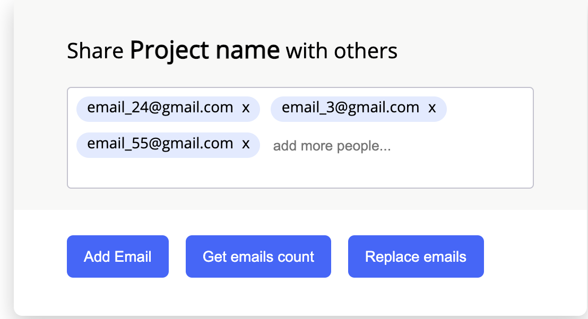

# emails-input
A reusable email input component in js ([Demo](https://irfanbsse2060.github.io/emails-input/))




## Features
- You can add multiple emails
- By pressing enter or losing focus, it will add value
- It will add invalid emails as well and it shows as invalid by red bottom border around that particular value,
- You can update the default place holder
- It will take 100 percent height of the parent element,and will handle things properly if it is overflowing by showing scroll
- You can remove the particular email by clicking on cross icon
- You can get all the valid emails count by calling `getValidEmailsCount`
- You can get all the email by calling `getAllEmails` ,
 it will return something like this `[{value:'user@domain.com', isValidEmail: true }, {value:'user.com', isValidEmail: false }]`
- You can past the emails in comma separated format, it will automatically add all the emails e.g `user@domain.com,user2@domaion.com`
- You can replace all the emails by calling `updateAllEmails` and pass list of emails as a arguments. 
e.g `updateAllEmails(['user@domain.com','user2@domain.com'])`

## How to use in code.
- Import font `<link rel="stylesheet" type="text/css" href="//fonts.googleapis.com/css?family=Open+Sans"/>`
- Import css file: ` <link rel="stylesheet"  href="emails-input/emails-input.css"/>`
- Import Js file: `<script src="emails-input/emails-input.js"></script>`
- Initialize the component by calling the method  `new EmailsInput(elementId, options)`,
 pass the element id as a first argument and option as a second argument.

 

## API (option object)
- placeholder (optional): For custom input place holder

- onAdd (optional):  Function to be called with new added email and all the emails added whenever
       user add new email
- onRemove (optional): Function to be called with new added email and all the emails added whenever
                                 user add remove an emal by clicking on cross icon       
       
# Example
```
var emailsInput = new EmailsInput('emails-input', {
       placeholder:'add more people...',
       onAdd: (email,data) =>{
           console.log(email)
           console.log(data)
       },
       onRemove: (email,data) =>{
           console.log(email)
           console.log(data)
       }
   });
```

# Technical Points:
-  Regarding styling, BEM is being used for class naming. Chances of conflicting with the project style,is very rare.
  You may face styling issue if you have same name of class (.email-input-container) in your project.
  We can avoid this by styling using javascript which i believe will affect the code readability that's why for now
  i have created separate css file. We can switch to this approach as well if its necessary, It won't take much time as we already have style defined.

### It is tested on the latest version of  firefox, safari, chrome, Microsoft Edge (Version 90.0.818.66 )


# Testing
- For testing please read [TEST.md](https://github.com/Irfanbsse2060/emails-input/blob/main/cypress/TEST.md)
